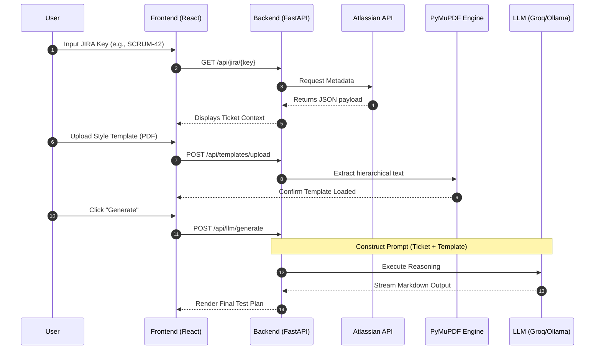

# 🚀 Nexus: Enterprise AI QA

**Nexus** is a premium, enterprise-grade AI orchestration engine designed to transform JIRA requirements into professional, structured test plans. Built on the **B.L.A.S.T.** protocol, it delivers high-fidelity QA intelligence through a sophisticated, modern workspace.

---

## 📸 Project Vision
The core mission of Nexus is to eliminate the manual overhead of test case creation. By analyzing JIRA tickets against organizational PDF templates, Nexus generates context-aware test scenarios that adhere to your company's specific documentation standards.

---

## 🖥️ Dashboard UI

The Nexus interface is designed for high-velocity QA workflows, featuring a premium 3-layer visual hierarchy:


*The premium workspace featuring glassmorphic components and AI intelligence.*

### Interface Components:
1.  **🎛️ Intelligent Sidebar (Glassmorphic):**
    -   **JIRA Deep-Sync:** Fetch ticket data with one click.
    -   **PDF Style Engine:** Upload reference templates to teach the AI your documentation style.
    -   **Engine Toggle:** Switch between Cloud (Groq) and Local (Ollama) inference.
    -   **🧹 Clear Workspace:** Instantly reset the environment for a new testing cycle.
2.  **📋 Requirement Surface (Center):**
    -   Detailed analysis of the JIRA context including Priority, Status, and full description.
3.  **🤖 Intelligence Workbench (Right):**
    -   **Generation Stepper:** Real-time visibility into the AI's processing stages.
    -   **Confidence Score:** Visual index of generation accuracy based on input quality.
    -   **Export Actions:** One-click **Markdown Export** and **Copy to Clipboard**.
4.  **⌨️ Command Palette:**
    -   Press `⌘ + K` (or `Ctrl + K`) to trigger a global command center for quick navigation and switching.

---

## 🧩 Key Features

-   **🔍 JIRA Deep-Sync:** Atomic fetching of ticket metadata to build high-fidelity context.
-   **📄 Template-Driven Learning:** Dynamically extracts structure from PDFs using **PyMuPDF**.
-   **🤖 Dual-Engine Orchestration:** Seamlessly toggle between Cloud speed (Groq) and Local privacy (Ollama).
-   **⌨️ Command Palette:** Global `⌘ + K` interface for tool-switching and search.
-   **📊 QA Confidence Matrix:** Real-time scoring and source citation for AI-generated output.
-   **🎨 Premium Motion Design:** Fluid animations, glassmorphism, and depth hierarchy for an elite user experience.
-   **📥 Direct Export:** Professional Markdown export for immediate JIRA/Confluence integration.

---

## 🏗️ Project Methodology: The B.L.A.S.T. Protocol

This project follows a strict architectural discipline to ensure reliability:

| Phase | Title | Description |
| :--- | :--- | :--- |
| **B** | **Blueprint** | Defining logic in `gemini.md` and `task_plan.md` before coding. |
| **L** | **Link** | Verifying JIRA and LLM connectivity via `tools/verify_jira.py`. |
| **A** | **Architect** | Building the 3-layer system (SOPs, Navigation, and Tools). |
| **S** | **Stylize** | Polishing the UI/UX and formatting the Markdown output. |
| **T** | **Trigger** | Final deployment and automated generation triggers. |

---

## 🛠️ Technology Stack

### Frontend (User Interface)
-   **React 18 & Vite:** Lightning-fast HMR and optimized builds.
-   **Tailwind CSS:** Professional styling with a focus on QA readability.
-   **Lucide React:** High-quality consistent iconography.

### Backend (The Core Engine)
-   **FastAPI:** High-performance asynchronous API framework.
-   **PyMuPDF (fitz):** Precision text extraction from complex PDF layouts.
-   **Groq & Ollama SDKs:** Robust connectors for cloud and local LLMs.
-   **Pydantic v2:** Atomic data validation and type safety.

---

## 📐 Detailed Project Structure

```text
TestPlanAIAgent-JIRA/
├── backend/                    # FastAPI Logic
│   ├── app/
│   │   ├── api/                # REST Gateways
│   │   │   └── endpoints/      # (jira.py, llm.py, templates.py)
│   │   ├── core/               # Configuration (config.py)
│   │   ├── models/             # Data structure (schemas/jira.py)
│   │   └── services/           # Business Logic (JiraClient, LLMService)
│   └── main.py                 # Application Bootstrap
├── frontend/                   # UI Application
│   ├── src/
│   │   ├── components/         # Atomic UI elements
│   │   ├── hooks/              # API interaction logic (useJira, useLLM)
│   │   └── App.tsx             # Master Dashboard Layout
├── architecture/               # Standard Operating Procedures (SOPs)
│   └── backend_SOP.md          # Technical implementation rules
├── tools/                      # Deterministic Python Engines
│   └── verify_jira.py          # Connectivity check scripts
├── gemini.md                   # Project Constitution (Rules & Schemas)
├── task_plan.md                # Execution Roadmap
└── .env                        # Secure Credential Storage
```

---

## 🔄 System Flow & Data Pipeline



---

## 🚀 Getting Started

### 1. Prerequisites
-   **Environment:** Python 3.10+, Node.js 18+.
-   **Ollama:** Install from [ollama.ai](https://ollama.ai) (for local models).
-   **API Keys:** Obtain keys for JIRA (Atlassian Token) and Groq.

### 2. Quick Setup

**Backend:**
```bash
cd backend
python -m venv venv
source venv/bin/activate
pip install -r requirements.txt
# Configure .env with JIRA_URL, JIRA_EMAIL, JIRA_API_TOKEN, GROQ_API_KEY
python main.py
```

**Frontend:**
```bash
cd frontend
npm install
npm run dev
```

---

## 📖 Step-by-Step Usage

1.  **Handshake:** Ensure `.env` is set. Use `python tools/verify_jira.py` to confirm connection.
2.  **Lookup:** Enter your JIRA ID in the left sidebar. The system will pull the latest requirements.
3.  **Style:** Upload a PDF that represents your ideal test plan format. Nexus will learn the structure instantly.
4.  **Inference:** Select your preferred LLM. Use **Groq** for complex feature sets or **Ollama** for simple/confidential internal tickets.
5.  **Output:** Copy the generated Markdown and paste it into your JIRA comment or Confluence page.

---

## 📝 Project Artifacts
-   **Architecture SOPs:** See `/architecture` for deep-dives into backend logic.
-   **Project Memory:** `task_plan.md` and `progress.md` track the development journey.
-   **Data Schemas:** Defined in `gemini.md`.
